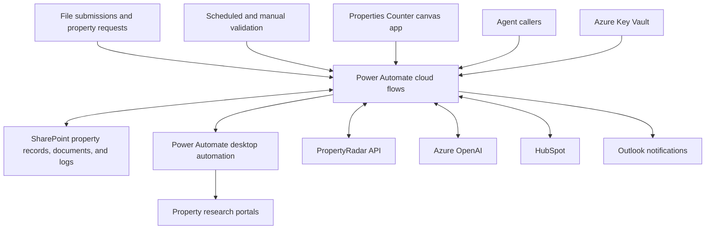

# UCH Automated Valuation Project

UCH AVP automates property intake, research, valuation processing, and CRM synchronization for Upside Capital Holdings. It is a Microsoft Power Platform solution combining Power Automate cloud flows, desktop automation, SharePoint data storage, and a Power Apps canvas app.

The exported solution is named **Project Automated Valuation**, with unique name `ProjectAVP`. This documentation describes the files in this repository; deployment status and live behavior have not been verified.

For a new computer, follow the [Power Platform setup guide](docs/power-platform-setup.md) to install PAC CLI, create local configuration, authenticate, discover the environment, and export/unpack the solution. Start with [the configuration template](powerplatform.config.example.json).

## What the system does

- Imports property data from submitted files and adds or updates property records.
- Maintains a work queue for property validation and valuation processing.
- Matches properties with PropertyRadar and retrieves transaction history.
- Runs desktop automation against CoStar, Zillow, Redfin, and Realtor to generate reports or extract property details and estimates.
- Extracts CoStar comparable-sales reports and stores summary information.
- Uses Azure OpenAI request flows for prompt-based processing and image analysis.
- Updates valuation results and computes loan-to-value (LTV) information.
- Creates or updates HubSpot deals and activities, and processes incoming HubSpot changes.
- Stores supporting documents and activity history in SharePoint.
- Sends event notifications and daily deal summaries.
- Exposes property queries and SharePoint operations through flows that can be called by an agent.

## Architecture

The diagram summarizes the components and their roles. Individual flows have their own triggers and conditions; this is not a single execution sequence.



## Repository structure

```text
README.md
docs/
  workflows.md                     Workflow inventory and exported entry points
  desktop-automation.md            Desktop process, routing, callbacks, and recovery
  rpa/
    costar.md                      CoStar login, report paths, downloads, and uploads
    zillow.md                      Zillow search, matching, and detail extraction
    redfin.md                      Redfin search, estimates, and detail extraction
    realtor.md                     Realtor.com search, estimates, and detail extraction
src/powerplatform/ProjectAVP/
  ProjectAVP.cdsproj                MSBuild project for packaging the solution
  src/
    Other/
      Solution.xml                 Solution identity, version, and dependencies
      Customizations.xml           Connection-reference definitions
    Workflows/                     Flow JSON and XML, including embedded desktop script
    CanvasApps/                    Properties Counter .msapp and metadata
    environmentvariabledefinitions/ Configuration definitions and exported values
    desktopflowbinaries/           Desktop automation metadata and supporting assets
```

The export contains **37 cloud flows**, **one desktop-flow record**, **one canvas app**, and **69 environment-variable definitions**. The desktop action script is stored in the desktop flow's companion `.json.data.xml` file, in its `<Definition>` element, and contains approximately 2,082 lines and 28 subflow definitions. See the [workflow reference](docs/workflows.md) for the complete inventory and the [desktop automation documentation](docs/desktop-automation.md) for the RPA process, source-specific behavior, and runtime verification limits.

Detailed portal guides trace the implemented steps, matching rules, outputs, and failure paths: [CoStar](docs/rpa/costar.md), [Zillow](docs/rpa/zillow.md), [Redfin](docs/rpa/redfin.md), and [Realtor.com](docs/rpa/realtor.md).

## Main workflow groups

| Area | Principal workflows | Purpose |
| --- | --- | --- |
| Intake | Manual Data Submission, Add to Property List | Process submitted files and maintain property records. |
| Queue and validation | Fetch Work Queue, Validate Properties, Update Work Queue, Schedule Trigger | Select work, invoke research automation, and record results. |
| Research | Match with PropertyRadar, Get Transaction History, Extract CoStar Report | Enrich property records and process comparable-sales information. |
| AI | Fetch LLM Prompt, Post OpenAI Request, Fetch Image Analysis | Retrieve prompts and submit text or image requests. |
| CRM | Post HubSpot Deal, Post HubSpot Activity, HubSpot Webhook URL | Exchange deal and activity information with HubSpot. |
| Documents and history | Upload File, Create Sync Folder, AVP Change Tracker | Organize files and track record changes. |
| Agent access | Query AVP Database, SharePoint Bridge, SharePoint History Bridge, SharePoint Search Bridge | Provide queries, document access, and history to callers. |
| Operations | Handle Validation Issues, Send Event Notification, Send AVP Daily Summary | Handle processing issues and send operational updates. |

The **UCH-AVP Properties Counter** canvas app references the Get Items Count flow and a SharePoint connection.

## External dependencies and configuration

Configuration is exported under `src/powerplatform/ProjectAVP/src/environmentvariabledefinitions/`. Connection references are declared in `Other/Customizations.xml` and referenced by the flow definitions.

| Dependency | Role | Configuration examples |
| --- | --- | --- |
| SharePoint Online | Property records, imports, comparable sales, transaction history, configuration, and logs | `clr_UCHAVPSharePointSite`, `clr_UCHAVPSharePointListPropertyRadar`, `clr_UCHAVPSharePointLibraryDocuments` |
| Power Automate desktop | Research automation executed by the validation flow | `clr_UCHAVPRunMode`, portal URLs, research credentials |
| CoStar, Zillow, Redfin, Realtor | Property research portals used by the desktop flow | CoStar/Zillow/Redfin environment settings and the Realtor URL supplied by the validation flow |
| PropertyRadar | Property matching and transaction enrichment | `clr_UCHAVPPropertyRadarAPIEndpoint`, list IDs, secret name |
| Azure OpenAI | AI request processing | `clr_UCHAVPAzureOpenAIEndpoint`, `clr_UCHAVPAzureOpenAIDeployment`, `clr_UCHAVPAzureOpenAISecretName` |
| Azure Key Vault | Secrets accessed by integration flows | `clr_UCHAVPAzureKeyVaultURI`, service-specific secret names |
| HubSpot | Deals, pipeline stages, activities, and incoming updates | `clr_UCHAVPHubSpotAPIEndpoint`, `clr_UCHAVPHubSpotDataPipeline`, `clr_UCHAVPSharePointListAVPHBMapping` |
| Microsoft 365 | Email, Excel import processing, and Copilot-related access | Notification settings, `clr_UCHAVPExcelScriptIDConverttoTable`, Copilot client/token settings |
| HTTP bridge services | SharePoint requests, search, and callback endpoints | `clr_UCHAVPSharePointConnectorURL`, `clr_UCHAVPSearchOneDriveConnectorURL`, `clr_UCHAVPAtlasCallbackURL` |

Variable names are reproduced as exported, including existing spelling such as `clr_UCHAVPSharePointListTransctons`. Use the actual schema names when configuring an environment.

## Build and package

Use a .NET SDK/MSBuild installation capable of building the `.cdsproj`, with access to its NuGet dependencies. The project references `Microsoft.PowerApps.MSBuild.Solution` version `1.*` and .NET Framework reference assemblies. Microsoft documents `dotnet build` and `msbuild` for solution projects in its [Power Platform CLI solution reference](https://learn.microsoft.com/en-us/power-platform/developer/cli/reference/solution).

From the repository root:

```powershell
dotnet build .\src\powerplatform\ProjectAVP\ProjectAVP.cdsproj --configuration Release
```

Alternatively, with MSBuild available:

```powershell
msbuild .\src\powerplatform\ProjectAVP\ProjectAVP.cdsproj /restore /p:Configuration=Release
```

Inspect the build output under the solution project's `bin` directory for the generated solution package. These commands are documented starting points; a successful build has not been verified for this checkout.

## Environment setup

1. Prepare a Power Platform environment with Dataverse and permissions to import solutions and configure connections.
2. Build the solution package and import it through the target environment's solution interface.
3. Bind connection references to the appropriate SharePoint, Outlook, Excel, Key Vault, desktop-flow, and management connections. Resolve any additional connection dependencies reported during import.
4. Configure environment-variable values for the target environment, including SharePoint lists/libraries, API endpoints, pipeline IDs, notification recipients, and secret references.
5. Ensure the referenced SharePoint lists and libraries exist with the fields expected by the flow actions. Their provisioning scripts and full schemas are not included here.
6. Configure the desktop execution machine, required Power Automate runtime/licensing, Microsoft Edge, portal access, and credentials. Validate the imported desktop script and UI assets in Power Automate Desktop before enabling validation; source availability alone does not verify a successful import or execution.
7. Configure the Excel script, external bridge endpoints, HubSpot integration, and agent callers used by the workflows you intend to enable.
8. Validate a sample property end to end in the target environment, then enable scheduled flows and event-driven processing as appropriate.

The repository packages solution components. SharePoint resources, external services, machine configuration, and a complete agent definition are not provisioned by the files shown here.

## Development and verification

Make flow and app changes in the relevant Power Platform authoring tools, then export/unpack the updated solution into this repository. Review changes to workflow JSON together with the corresponding `.json.data.xml` metadata, environment variables, and connection references.

For a deployment or behavior change, verify the affected path in a test environment:

- Import a sample submission and confirm its property fields and queue status.
- Run validation and confirm desktop execution, uploaded files, and resulting record updates.
- Confirm PropertyRadar matching and comparable-sales extraction on known sample records.
- Check LTV results and HubSpot field mappings against expected values.
- Verify notification recipients and agent-query results for the configured environment.
- Review Power Automate run history for failed actions and unexpected repeat processing.

There is no automated test suite or CI pipeline in this checkout. Building a package checks packaging, while live integration behavior requires environment-level verification.

## Export limitations

- The desktop-flow JSON has an empty `properties.definition.package` string, but its companion `.json.data.xml` contains the action script in `<Definition>` and input declarations in `<Inputs>`. Use both files when reviewing the desktop implementation. Its process can be reconstructed from source; successful import, current selector compatibility, and live execution still require verification.
- The canvas app is stored as a binary `.msapp`; editable canvas source files are not present.
- Several flows call external endpoints or other flows. Their availability and authorization must be checked in the target environment.
- Exported configuration is environment-specific. Review values when moving the solution between environments.
- The description above is based on exported definitions, not production run history.
