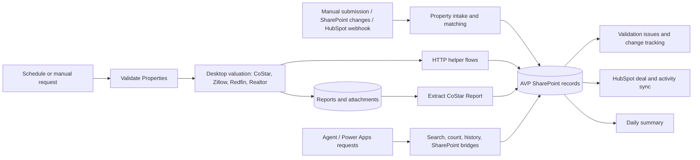

# Cloud automation

This guide covers the **37 cloud flows** in the unpacked `ProjectAVP` solution. Each flow has a [detailed guide](cloud-flows/) generated from its exported definition. The [workflow inventory](workflows.md) also includes the single desktop flow. The export shows configured logic; run history and active connections are needed to confirm live behavior.

## How the flows work together

The arrows describe the exported event and call relationships at a system level. A SharePoint change can trigger several independent flows; the diagram does not imply a guaranteed execution order. Direct child-flow calls are identified in the individual guides. HTTP callbacks, including the desktop helper endpoints, use configured URLs and are not represented as `Workflow` actions in the export.

### Intake and record maintenance

| Role | Flows |
| --- | --- |
| Submit and import property data | [Add to Property List](cloud-flows/addtopropertylist.md), [Manual Data Submission](cloud-flows/manualdatasubmission.md) |
| Match and enrich | [Match with PropertyRadar](cloud-flows/matchwithpropertyradar.md), [Get Transaction History](cloud-flows/gettransactionhistory.md) |
| Maintain status and files | [Create Sync Folder](cloud-flows/createsyncfolder.md), [Force to Intake](cloud-flows/forcetointake.md), [Force Validation URL](cloud-flows/forcevalidationurl.md) |
| React to changes and problems | [AVP Change Tracker](cloud-flows/avpchangetracker.md), [Handle Validation Issues](cloud-flows/handlevalidationissues.md) |

### Valuation and desktop orchestration

The [Schedule Trigger](cloud-flows/scheduletrigger.md) invokes [Validate Properties](cloud-flows/validateproperties.md) with `Pending` and a false CoStar flag. [Manual Validation Trigger](cloud-flows/manualvalidationtrigger.md) also invokes Validate Properties. Validation prepares settings, credentials, callback URLs, and work queues. A true CoStar flag routes to CoStar; false routes through Zillow, then Redfin, then Realtor scopes. A source's desktop run is skipped when its queue is empty. The Zillow invocation is limited to the first 200 queue items. See the [desktop automation guide](desktop-automation.md) for exact desktop behavior.

The desktop flow calls these cloud helpers through HTTP callbacks:

| Purpose | Flow |
| --- | --- |
| Queue read and status update | [Fetch Work Queue](cloud-flows/fetchworkqueue.md), [Update Work Queue](cloud-flows/updateworkqueue.md) |
| Report upload and downstream extraction | [Upload File](cloud-flows/uploadfile.md), [Extract CoStar Report](cloud-flows/extractcostarreport.md) |
| Authentication and prompts | [Fetch MFA Code](cloud-flows/fetchmfacode.md), [Fetch LLM Prompt](cloud-flows/fetchllmprompt.md) |
| AI and image processing | [OpenAI Request](cloud-flows/openairequest.md), [Post OpenAI Request](cloud-flows/postopenairequest.md), [Fetch Image Analysis](cloud-flows/fetchimageanalysis.md) |
| Notifications and endpoint discovery | [Send Event Notification](cloud-flows/sendeventnotification.md), [Get Callback URL](cloud-flows/getcallbakurl.md) |

The desktop flow records status and notes through Update Work Queue. An uploaded CoStar report can independently trigger Extract CoStar Report. Callback URL discovery is used by Validate Properties and some other flows; the exported action uses the spelling `GetCallbakURL`.

### CRM, reporting, and query surfaces

| Role | Flows |
| --- | --- |
| HubSpot sync | [HubSpot Webhook URL](cloud-flows/hubspotwebhookurl.md), [Post HubSpot Deal](cloud-flows/posthubspotdeal.md), [Post HubSpot Activity](cloud-flows/posthubspotactivity.md) |
| Scheduled reporting | [Send AVP Daily Summary](cloud-flows/sendavpdailysummary.md) |
| Property queries | [Search Property Listing](cloud-flows/searchpropertylisting.md), [Query AVP Database](cloud-flows/queryavpdatabase.md), [Get Items Count](cloud-flows/getitemscount.md) |
| Agent and SharePoint access | [SharePoint Bridge](cloud-flows/sharepointbridge.md), [SharePoint Connector](cloud-flows/sharepointconnector.md), [SharePoint History Bridge](cloud-flows/sharepointhistorybridge.md), [SharePoint Search Bridge](cloud-flows/sharepointsearchbridge.md), [SharePoint Search Connector](cloud-flows/sharepointsearchconnector.md), [Log Helper Interaction](cloud-flows/loghelperinteraction.md) |
| Authentication support | [Refresh Copilot Token](cloud-flows/refreshcopilottoken.md) |

## Reading the detailed guides

Each guide links to its exported JSON and includes its purpose, trigger, connector families, top-level sequence, full nested action map, `runAfter` dependencies, and direct child-flow links. Action paths preserve the export's names so they can be found in Power Automate or the JSON. They intentionally omit live URLs, request body values, credentials, and signed callback URLs. Conditions, schemas, expressions, and connector parameters remain in the linked definition for code review.

These docs were generated with [`scripts/generate-cloud-flow-docs.cjs`](../scripts/generate-cloud-flow-docs.cjs). After a solution export changes, rerun the generator and review the resulting diff against the updated definitions. The [Power Platform setup guide](power-platform-setup.md) describes environment verification and safe export procedures.
