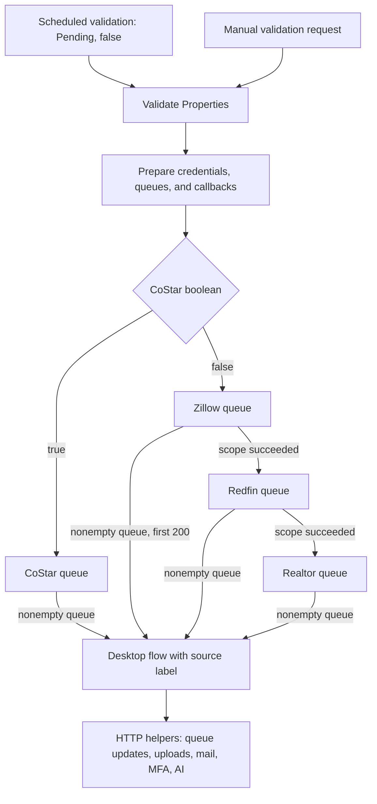

# Desktop Automation (RPA)

This document describes the desktop implementation and cloud orchestration in the `ProjectAVP` solution. The desktop action script is present in the companion XML file. Its process, branches, UI actions, callbacks, and error handling can be inspected locally.

## Source of truth

The desktop flow is **UCH-AVP Automated Valuation Desktop Flow**, ID `2e6975e7-8c20-4f15-9fec-ac412e9a55dd`.

| Artifact | What it contains |
| --- | --- |
| [Desktop JSON wrapper](../src/powerplatform/ProjectAVP/src/Workflows/UCH-AVPAutomatedValuationDesktopFlow-2E6975E7-8C20-4F15-9FEC-AC412E9A55DD.json) | An empty `properties.definition.package` and empty input/output schemas. This file alone is incomplete for code review. |
| [Desktop XML definition](../src/powerplatform/ProjectAVP/src/Workflows/UCH-AVPAutomatedValuationDesktopFlow-2E6975E7-8C20-4F15-9FEC-AC412E9A55DD.json.data.xml) | A JSON-encoded desktop script in `<Definition>`, input declarations in `<Inputs>`, and other flow metadata. |
| [Desktop assets](../src/powerplatform/ProjectAVP/src/desktopflowbinaries) | UI control repository, image repository, manifest, dependencies, and screenshots referenced by the script. |
| [Validation cloud flow](../src/powerplatform/ProjectAVP/src/Workflows/UCH-AVPValidateProperties-821B8546-78CF-F011-BBD3-7C1E5217E110.json) | Queue selection, credentials/configuration preparation, and desktop invocation through `RunUIFlow_V2`. |

### Inspecting the script

From the repository root, this PowerShell example loads the definition and lists subflow names without displaying input defaults:

```powershell
$desktopPath = '.\src\powerplatform\ProjectAVP\src\Workflows\UCH-AVPAutomatedValuationDesktopFlow-2E6975E7-8C20-4F15-9FEC-AC412E9A55DD.json.data.xml'
[xml]$desktopXml = Get-Content -LiteralPath $desktopPath -Raw
$desktopScript = $desktopXml.Workflow.Definition | ConvertFrom-Json
$desktopLines = $desktopScript -split '\r?\n'
$desktopLines | Where-Object { $_ -match '^FUNCTION ' }
```

XML parsing handles XML entities; `ConvertFrom-Json` then decodes the script string and its escaped newlines. Inspect individual functions in `$desktopLines` to trace actions. Input defaults include environment-specific data and signed callback URLs; avoid copying these values into documentation.

## Cloud orchestration



The [scheduled trigger](../src/powerplatform/ProjectAVP/src/Workflows/UCH-AVPScheduleTrigger-A0BE04EA-77CF-F011-BBD3-7C1E5217E110.json) calls validation with `text = Pending` and `boolean = false`. In validation, `CoStar_Run` tests whether `triggerBody()?['boolean']` equals true.

- **True:** the CoStar branch fetches its queue and invokes the desktop flow when it is nonempty.
- **False:** Zillow, Redfin, and Realtor scopes execute in that order. Redfin requires the Zillow scope to succeed; Realtor requires the Redfin scope to succeed. Each scope invokes the desktop flow only for a nonempty source queue.
- The Zillow desktop input applies `take(..., 200)`; the other source calls pass their corresponding queue results.

Thus a false-branch invocation does not guarantee three desktop runs: empty queues skip invocation, and scope failures affect subsequent execution.

## Inputs and runtime setup

| Input | Purpose |
| --- | --- |
| `aryWorkQueue` | Property records to process, including ID, Title, Address, City, State, Zip, and Property Type. |
| `strValuationSource` | Chooses CoStar, Zillow, Redfin, or Realtor processing. |
| CoStar username/password | Supplied by cloud configuration and Key Vault retrieval; the password is marked sensitive in the desktop script. |
| Portal base URLs | Starting URLs supplied by the cloud flow. |
| Notification settings | Business/support recipients and notification label. |
| Helper callback URLs | Queue fetch/update, email, uploads, MFA, prompt retrieval, OpenAI, and image analysis. |
| `tblExceptions_Tracker` | Step names, attempt counters, and error information used by recovery logic. |

`runMode` is a parameter of the cloud desktop-run action, sourced from `clr_UCHAVPRunMode`; it is not one of the desktop script's `@INPUT` declarations. The desktop connection reference is `clr_UCHAVPDesktopFlowConnection`.

The runtime needs an available Power Automate desktop machine or machine group, Microsoft Edge with the required automation support, portal access, and working cloud connections/callbacks. The script also invokes PowerShell for JSON escaping and uses the user's Downloads directory and a `UCH-AVP` workspace under the temporary directory.

## Desktop execution sequence

The top-level script calls `Flow: Initialize Variables`, then `Flow: Orchestrate Flow`. Orchestration uses a `SWITCH strFlowStep` and a loop back to its dispatch label.

1. **Initialize variables.** Set working/download paths, create the temporary workspace if needed, configure the address-matching prompt, and set the per-step attempt limit to 3.
2. **Prepare the browser.** The initial step is `Clear Canvass`. It tries to preserve the tracked browser while closing other matching Edge windows or extra tabs, and can recycle the browser when cleanup fails.
3. **Initialize the selected portal.** Launch or navigate Edge to the selected source. CoStar includes login and MFA handling.
4. **Load the first queue item.** Reset item state, read fields, validate required details, and select a report type.
5. **Process the property.** Run CoStar reporting or the source-specific residential extraction path.
6. **Persist results.** Upload report files where applicable and call the queue-update helper with status and notes.
7. **Advance or recover.** Remove the first local queue item only after a successful update. Continue to the next item, restart browser preparation after a reported item failure, or finish when the queue is empty.
8. **Wrap up.** Call `Clear Canvass` again.

A separate `Initialize Work Queue` state and helper exist, but the normal entry path starts at `Clear Canvass` and uses the supplied queue.

## Property validation and routing

`Flow: Queue Work Item` checks City, State, Zip, Address, and Property Type. Empty values and recognized placeholders such as `Unknown` or `NOT AVAILABLE` are rejected for the location fields. For property codes other than `LND` and `AGR`, the address must start with a digit from 1 to 9.

| Input property codes | Report path | Category mapping |
| --- | --- | --- |
| AGR, LND, REC | CoStar Land | Land |
| APT, MFR | CoStar Underwriting | Multi-Family |
| COM | CoStar Underwriting | Retail Property, Shopping Center, Office |
| GOV, UTL | CoStar Underwriting | Industrial, Retail Property, Shopping Center, Office |
| IND | CoStar Underwriting | Industrial |
| OFC | CoStar Underwriting | Office |
| RTL | CoStar Underwriting | Retail Property |
| CND, OTH, RES, SFR, UNK | Single Family Report | Condominium, Others, Misc Residential, Single Family, Unknown, respectively |

Unsupported codes, missing details, or a mismatch between a CoStar report type and the selected valuation source produce a skip reason. Residential report types dispatch to Zillow, Redfin, or Realtor according to `strValuationSource`.

## Source-specific processing

The summaries below introduce each path. The dedicated guides provide ordered UI steps, exact matching rules, callback/result handling, timeouts, failure outcomes, and decoded-script locations.

| Portal | Detailed guide |
| --- | --- |
| CoStar | [Authentication, underwriting, land reports, fallback, and file handling](rpa/costar.md) |
| Zillow | [Search, human-verification prompt, address checks, and property details](rpa/zillow.md) |
| Redfin | [Initialization, matching, estimates, and property details](rpa/redfin.md) |
| Realtor.com | [Search without ZIP, final address checks, estimates, and expanded details](rpa/realtor.md) |

### CoStar

**Login and MFA:** the initializer launches or reuses Edge, fills the username and password when the login form appears, and clicks Log In. If the code field appears, it calls `Flow: Get MFA Code`, fills the returned code, and clicks Verify. The MFA helper requests `CoStar Access Code` from the supplied endpoint and reads the response's `Response` field. Its loop waits 30 seconds before each request.

**Underwriting:** open the underwriting form, try the mapped property categories, enter the subject address, and inspect suggested matches using address/city/state checks. Generate a report for a matching selection and save the PDF through Edge's viewer and Save As dialog. If this path completes without a skip reason but produces no report file, orchestration switches to the all-properties fallback.

**Land:** search by ZIP and city, select Land, choose **Sold Within 3 Years** when the Date Range control is present, and constrain land area to **0.5–10 acres**. The two configured sale-comps modes select different report bundles:

- Sale Comps Map & List Report and Trend Report - 4 graphs per page.
- Sale Comps Summary Report, Comp Detail Sheet, Contact Report, and Classic One Page Report.

The flow handles missing location/results, report selection overflow, rendering errors, and PDF downloads.

**All-properties fallback:** search the full address, evaluate candidate matches, and use the OpenAI address-matching helper when direct comparisons do not select a match. Open the property and try Full Underwriting Report, then Property Summary Report; the option loop exits after selecting the first available option. When a header address is available, orchestration requests a property-type classification through OpenAI before uploading.

### Zillow

Search for the full address, evaluate suggested matches, and check the opened property's address. Direct matching can fall back to the OpenAI address-matching helper. Extract the property section text and page URL, fetch the external prompt named **Zillow Details**, and submit the extracted information to OpenAI. A nonempty response is added to the update notes under `Zillow Details`.

The script contains a human-verification detection branch that emails support and displays an interactive dialog asking a person to complete the challenge. This check follows the search-field wait. Successful processing proceeds to the queue update with status **Pending**.

### Redfin and Realtor

Each portal has its own initializer, search selectors, candidate matching, and final address check. Redfin enters Address, City, State, and ZIP; Realtor enters Address, City, and State, then includes ZIP in the final property-page address check. Each extraction subflow reads the available estimate, property details, and page URL. Realtor expands a Show More section when present.

The flows fetch **Redfin Details** or **Realtor Details** prompts, call OpenAI, and place nonempty responses under the corresponding detail key in update notes. Successful orchestration assigns **Processed**. The Redfin initializer also contains a security-control branch that uses the image-analysis callback; its behavior depends on the live page and external prompt/service response.

These paths do not establish the contents of the externally stored prompts or guarantee that every page supplies an estimate.

## Callbacks, files, and statuses

The desktop flow makes HTTP calls to helpers; these are implemented actions, not merely unused input declarations.

| Helper | Desktop behavior |
| --- | --- |
| Fetch queue | Available through `Flow: Initialize Work Queue`; normal invocation already supplies the queue. |
| Update queue | Posts `ID`, `Status`, `Source`, `Notes`, and `URL`. Notes contain the property Title, Manual Address, and source-specific result details when populated. |
| Upload file | Converts each report to base64, deletes the local source file, constructs an attachment name, and posts it under a folder keyed by property Title. |
| Send notification | Sends operational alerts; selected error paths include a screenshot. |
| Fetch MFA | Requests a CoStar access code and reads `Response`. |
| Fetch LLM prompt | Requests a prompt by Title and reads `Prompt`. |
| OpenAI request | Supports address matching, property classification, and processing extracted information. |
| Image analysis | Called from the Redfin initialization security-control branch. |

The upload helper's local deletion occurs **before** the upload request; an unsuccessful upload should therefore be investigated using the helper run history and the remaining in-memory payload, rather than assuming the downloaded file remains on disk.

| Desktop status | Where it is assigned |
| --- | --- |
| Pending | Successful Zillow extraction path. |
| Processed | Successful Redfin/Realtor extraction or report upload path. |
| Skipped | Invalid/mismatched queue item; for CoStar land, the skip routine uses this status when the overflow OK control is still present, otherwise it uses No Match. |
| No Match | Source/report lookup failures handled by the skip routine, except its special cases. |
| Failed | Failure-reporting path when there is a current item ID. |

These are assignments made by the desktop script. The receiving cloud flow may perform further updates or processing. A successful source subflow does not by itself prove that an estimate or AI response was populated.

## Retries and failure recovery

`Flow: Check Flow Status` looks up the current step in `tblExceptions_Tracker`. For a failed subflow, it captures the last error (or a supplied override), increments the step's counter while it is below the configured limit of 3, and changes the result to `Retry`. After the limit is reached, the failure remains available to orchestration. Successful/non-failed results reset the tracked counter.

Recovery depends on the dispatch branch. Portal/report branches commonly route `Retry` through `Clear Canvass`; other branches may repeat their current state. Action-level handlers add their own retries and waits, so the limit does not mean three total network calls for an entire property.

Examples visible in the implementation:

- Several HTTP helpers loop from 0 through 3 and have additional action-error retry handlers.
- Queue updates require HTTP 200; unsuccessful responses wait 60 seconds between attempts. The item stays in the local queue until the update succeeds.
- PDF viewer waits can last up to 300 seconds before the save step.
- Reported item failures send an alert, set `Failed`, and request a browser restart after the status update.
- A terminal queue-update failure sends an alert and wraps up the run.
- Skip handling distinguishes invalid input from lookup failures and records a reason.

## Subflow inventory

The names below are defined in the XML script. Definition presence does not imply every routine runs on the normal entry path.

| Group | Subflows |
| --- | --- |
| Initialization and dispatch | Flow: Initialize Variables; Flow: Orchestrate Flow; Flow: Clear Canvass; Flow: Wait |
| Queue and recovery | Flow: Initialize Work Queue; Flow: Queue Work Item; Flow: Check Flow Status; Flow: Get Flow Exception; Flow: Skip Queue Item; Flow: Report Failure; Flow: Update Status |
| Integrations | Flow: Email Alert; Flow: OpenAI Request; Flow: Get MFA Code; Flow: Get LLM Prompt; Flow: Upload File |
| CoStar | CoStar: Initialize Web App; CoStar: Generate Underwriting Report; CoStar: Generate Land Report; CoStar: All Properties Report |
| Zillow | Zillow: Initialize Web App; Zillow: Extract Home Details |
| Redfin | Redfin: Initialize Web App; Redfin: Extract Valuation |
| Realtor | Realtor: Initialize Web App; Realtor: Extract Valuation |
| Development/support | __QuickTests; __Dump |

The script includes `DISABLE` actions, and `__Dump` contains disabled report-generation steps. These must not be described as active production behavior. The top-level entry calls initialization and orchestration, not the development/support routines.

## UI assets and verification limits

The desktop assets contain 130 control-repository screenshots, three image-repository screenshots, and JSON files for the control repository, image repository, dependencies, and manifest. The dependencies file lists no environment variables; runtime inputs are supplied through the cloud flow and desktop declarations.

The script and repositories support detailed source-level documentation of selectors, navigation, extraction, branching, and recovery. The following still require the environment or representative run history:

- Successful solution import and desktop execution on the intended machine.
- Compatibility of selectors and browser actions with current portal pages.
- Working credentials, MFA delivery, connections, and callback endpoints.
- Actual contents of externally stored prompts and configuration records.
- Real output quality and behavior on properties with missing or ambiguous data.

No desktop run or external service invocation was performed to prepare this documentation.

## Related documentation

- [Project README](../README.md)
- [Workflow inventory](workflows.md)
- [Queue update cloud flow](../src/powerplatform/ProjectAVP/src/Workflows/UCH-AVPUpdateWorkQueue-EFE9CC19-FCBE-F011-BBD3-7C1E5217E110.json)
- [Report upload cloud flow](../src/powerplatform/ProjectAVP/src/Workflows/UCH-AVPUploadFile-06107A9A-75BF-F011-BBD3-7C1E5217E110.json)
