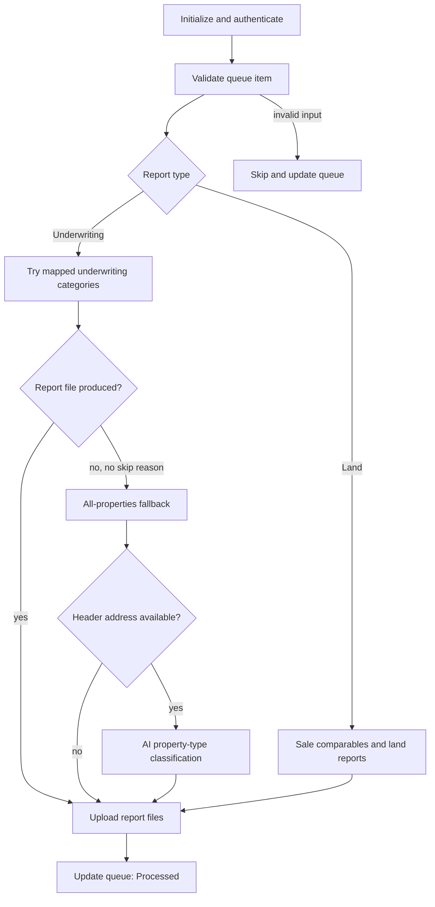

# CoStar desktop process

[RPA overview](../desktop-automation.md) · [Zillow](zillow.md) · [Redfin](redfin.md) · [Realtor.com](realtor.md)

This guide traces the exported implementation, including its UI actions and branch conditions. It describes the code in this checkout, not a verified live CoStar session. Selector names below are repository labels; their current compatibility with the website requires runtime verification.

## Source and entry conditions

The [desktop XML](../../src/powerplatform/ProjectAVP/src/Workflows/UCH-AVPAutomatedValuationDesktopFlow-2E6975E7-8C20-4F15-9FEC-AC412E9A55DD.json.data.xml) contains the script in `<Definition>`. Line numbers here refer to the **decoded script**, not XML file lines; use the extraction instructions in the [overview](../desktop-automation.md#inspecting-the-script).

| Subflow | Decoded starting line | Responsibility |
| --- | --- | --- |
| `CoStar: Initialize Web App` | 883 | Browser, login, announcements, MFA |
| `CoStar: Generate Underwriting Report` | 935 | Category-based subject search and underwriting PDF |
| `CoStar: Generate Land Report` | 1046 | ZIP/city sale comparables and land report bundles |
| `CoStar: All Properties Report` | 1296 | Address-search fallback and first available report option |

The validation cloud flow enters its CoStar branch when its Boolean input is true. A nonempty CoStar queue is passed to the desktop flow with `strValuationSource = CoStar`. Shared initialization prepares the browser and then validates each queue item before choosing a report path.

Required runtime inputs include the queue, CoStar base URL, username/password, exception tracker, notification settings, and callback URLs. The cloud flow retrieves the password from Key Vault. The desktop flow uses Edge, the user's Downloads directory, and its temporary workspace.

## Routing by property type

| Queue code | Desktop report path | Categories tried |
| --- | --- | --- |
| AGR, LND, REC | Land | Land |
| APT, MFR | Underwriting | Multi-Family |
| COM | Underwriting | Retail Property, Shopping Center, Office |
| GOV, UTL | Underwriting | Industrial, Retail Property, Shopping Center, Office |
| IND | Underwriting | Industrial |
| OFC | Underwriting | Office |
| RTL | Underwriting | Retail Property |

Missing location/type information, unsupported codes, or a residential report type arriving in a CoStar run produces a skip reason before reporting. The shared address rule exempts only `AGR` and `LND` from the requirement that an address start with digits 1–9; `REC` routes to Land but is not exempt from that validation.

The diagram shows successful paths and the principal fallback. Each reporting subflow also has skip and failure exits described below.

## 1. Initialize and authenticate

1. Clear the subflow status. Launch Edge at `strWebApp_CoStar_BaseUrl` if no tracked browser exists; otherwise navigate the existing browser there. Launch/navigation actions have `ON ERROR REPEAT 3 TIMES WAIT 10` handlers.
2. If the stored Edge Restore control is present, click it and call the shared wait helper.
3. Enter a loop with up to 60 iterations. If the Username field exists, fill the supplied username and password, then click Log In.
4. Check for the CoStar Properties menu. If it exists and no announcement Close control remains, leave the loop. Otherwise close the announcement when present.
5. If the Properties menu is absent, wait two seconds between checks; reaching the final iteration produces a login/MFA failure. This is not a strict two-minute timeout because login actions and MFA calls add time.
6. If the Code input appears, call `Flow: Get MFA Code`. That helper waits 30 seconds before each of up to four request-loop iterations, requests `CoStar Access Code`, and reads the response's `Response` value. Additional action-error retries may extend the wait.
7. If the helper reports failure, exit. Otherwise fill the returned code and click Verify, then continue checking the page.
8. Return `Done` when initialization completes. Orchestration then queues the first property.

## 2A. Underwriting report

1. Reset the skip reason and report-file list. Wait, and attempt to close the existing report popup; the popup-close error is ignored.
2. Navigate to the configured base URL plus `search/all-properties` and wait up to 60 seconds for **Underwriting & Rent Survey Reports**.
3. If the exported Terms of Use Accept control appears, the script clicks it. Click the reporting link; click New Search Continue if present.
4. Wait up to 60 seconds for **Subject Location**.
5. Loop through the property's mapped categories in table order. Select the corresponding Property Type radio control and reset the match counter.
6. For up to three input attempts, enter `Address, City, State` and read the field back. The input check tests whether it contains the requested street address.
7. If No results found appears, stop trying that category and move to the next one. Otherwise wait up to 15 seconds for a Location Match; that wait's error is suppressed and the last error is cleared.
8. Inspect successive matches. A direct match must contain the requested address, city, and state. Increment the match counter for rejected candidates.
9. On a match, click it, wait up to 60 seconds for Generate Report, click Generate Report, and jump to PDF download. This exits category searching after the first successful selection; it does not deliberately generate a report for every category.
10. If the input still fails the read-back check on the third attempt, set `Fail` with an address-entry error.
11. If all categories are exhausted without a generated report, return `Done` with an empty report list. The statements that would set a no-match skip reason here are **disabled**. Orchestration therefore calls the all-properties fallback.
12. If a PDF is generated, save it using the download sequence below and append its path to `aryReport_FilePath`.

## 2B. Land report

1. Reset report state and loop over the two literal modes `sale-comps/` and `sale-comps`. The trailing slash is significant to the script's report-selection branch.
2. Close the report popup if present, navigate to `search/<mode>`, and wait up to 60 seconds for Sales Comp Location. The exported script also clicks Terms of Use Accept if present.
3. Enter the property's ZIP code with the physical keyboard action. Read it back and require equality with the requested ZIP. Retry entry up to three times.
4. Wait for location suggestions. Select the first inspected suggestion that starts with the ZIP and contains the city; otherwise advance the match counter. No accepted suggestion sets a no-match reason and exits the subflow.
5. Read the Type filter. If it does not contain Land, open the filter, check Land, close it, and recheck. Exhausting the loop produces a configuration failure.
6. If Date Range exists, open Date Range, choose Sold Within, and select **Sold Within 3 Years**. If the Date Range control is absent, this block makes no change; it does not independently verify the effective period.
7. Read Size. If it already contains `0.5 - 10 AC`, continue directly to reporting. Otherwise open Size, set units to AC, minimum to 0.5 AC, and maximum to 10 AC, verifying the expected controls. Failed setting checks produce explicit failures.
8. If No Results Found is visible, set a no-match reason and exit.
9. Click Reports. If the Reports Internal Error element appears, use `NEXT LOOP` to move to the next mode. This branch does not itself mark the item failed.
10. Wait for report options and select available options from the applicable list:

| Mode | Requested options |
| --- | --- |
| `sale-comps/` | Sale Comps Map & List Report; Trend Report - 4 graphs per page |
| `sale-comps` | Open Bundles, then Sale Comps Summary Report; Comp Detail Sheet; Contact Report; Classic One Page Report |

11. Dismiss an overflow OK dialog when encountered while selecting options. If Report Next is absent afterward, record the too-many-properties skip reason and exit.
12. Click Report Next, wait for Generate Report, and generate the report. The script sets `strQueueItem_Address` to `ReportWizard` for subsequent UI handling and waits ten seconds.
13. If the stored Server Error element is visible, set `Fail`, clear the tracked browser object, and exit.
14. Save the PDF. For the second mode, prefix the local filename with `BundleReport-`. Close the report popup and append the path to the file list.
15. Continue to the next mode. At the end, return `Done`.

The intended normal result is a file from each mode, but the code can continue past an Internal Error or unavailable options. It does not enforce an exact report count before upload.

## 2C. All-properties fallback

1. Reset report state and the header-address variable, close the report popup, and navigate to `search/all-properties`.
2. Wait up to 60 seconds for Address. Click the exported Terms of Use Accept and Address Clear controls when present.
3. Enter `Address, City, State ZIP` with the physical keyboard action, and verify the field contains the full requested string. Up to three entry attempts are allowed.
4. Wait up to 60 seconds for Address Match. Inspect suggestions: a direct match starts with the street address and contains ZIP, city, and state.
5. Save rejected suggestions as candidate IDs and addresses. If no direct match is selected but candidates exist, call the OpenAI address-matching helper. A nonnegative response is used as the candidate index; a negative response leads to no match.
6. For an AI-selected suggestion, read its address, retain the trimmed first comma-separated part as `strManualAddress`, select it, and continue.
7. Wait up to 15 seconds for Property Match. If the direct control is present, click it. Otherwise collect Possible Property Match candidates and ask OpenAI again. On an accepted candidate, focus it, wait five seconds, read the Address control into `strManualAddress`, and click that address. No candidates or a rejected match produces a skip reason.
8. Wait up to 30 seconds for Reports and read Header Address.
9. Open Reports and check options in this order: **Full Underwriting Report**, then **Property Summary Report**. The loop exits immediately after checking the first available option. It selects one available option rather than necessarily both.
10. Dismiss the overflow dialog if present. If Report Next is absent, record the overflow-related skip reason. Otherwise click Next, wait for Generate Report, generate, and check for the server-error condition.
11. Save the PDF, close the report popup, and append the path.
12. Back in orchestration, if Header Address is nonempty, call OpenAI to classify it using the embedded list: Industrial, Land, Multi-Family, Office, Retail Property, Shopping Center, Single-Family, Student. The returned value becomes the property-type variable before upload. If the header is empty, proceed directly to upload.

## 3. Save, upload, and update

### PDF save sequence

1. In a loop indexed 0–3, wait up to 300 seconds for PDF Viewer Save, call the shared wait helper, and click Save.
2. Wait up to 15 seconds for Save As File name. Break when present; if the final iteration still does not find it, return a save failure.
3. Read the proposed filename, combine it with the configured Downloads path, populate File name, and click Save.
4. Attempt to click overwrite Yes; errors from that optional action are ignored. Clear the last error, wait, and close the report tab/popup.
5. Add the local path to the report list.

### Upload and persistence

For each path, `Flow: Upload File` derives the extension, removes `#` from the address-derived filename text, converts the file to base64, and **deletes the local source before posting** the upload. BundleReport files use a source/address filename; other files include the property type as well. The attachment is sent under a folder named with the queue item's Title.

The upload helper retries unsuccessful responses and expects HTTP 200. It does not independently require a nonempty file list. On a successful upload subflow with no skip reason, orchestration sets `Processed` and calls `Flow: Update Status` with `ID`, `Status`, `Source`, `Notes`, and `URL`. The queue item is removed locally only after the update helper succeeds.

## Outcomes and troubleshooting

| Observation | Code path / result | What to inspect |
| --- | --- | --- |
| Login does not finish | Initialization failure and shared retry/recovery | Properties menu, announcement overlay, MFA helper run and code field |
| Underwriting finds no candidate | `Done` with no files; all-properties fallback | Category mapping and direct address checks |
| No land location or results | Skip handling, normally `No Match` | ZIP/city suggestions and active filters |
| Land report selection overflow | Skip handling chooses `Skipped` if its overflow OK control is still present; otherwise `No Match` | Dialog state when the skip routine executes |
| Report server error | `Fail`, tracked browser cleared | Report window, retry history, rendering availability |
| Download/upload failure | Retry or terminal failure handling | Save As controls, file list, callback response; local file may already be deleted |
| Terminal item failure | Notify support, set `Failed`, update, then restart browser preparation | Exception tracker and queue-update run |
| Queue update cannot complete | Alert and wrap up | Update helper status/response; local item has not been removed |

Shared retries are per step and coexist with action-level retries; they are not a single three-attempt limit for the whole property. Refer to the [recovery reference](../desktop-automation.md#retries-and-failure-recovery).

## Verification boundaries

Check a representative underwriting match, fallback match, land property, no-match case, and upload failure in a test environment before relying on current behavior. Validate actual PDF content and count, not only `Processed`. UI selectors, portal permissions, configured prompts, and live callback results have not been exercised while preparing this guide. Disabled actions and `__QuickTests`/`__Dump` are not part of this normal sequence.
