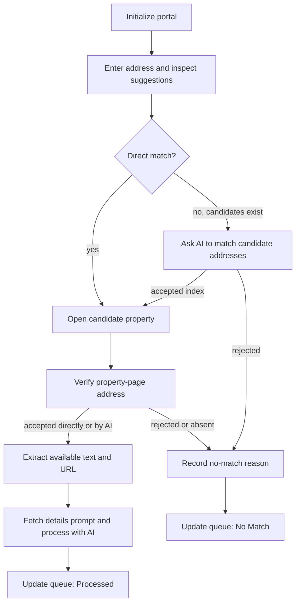

# Realtor.com desktop process

[RPA overview](../desktop-automation.md) · [CoStar](costar.md) · [Zillow](zillow.md) · [Redfin](redfin.md) · [Realtor.com](realtor.md)

Search Realtor.com, verify the selected property's address, extract the available estimate and details, process them with the Realtor Details prompt, and update the queue.

## Source and entry conditions

The [desktop XML definition](../../src/powerplatform/ProjectAVP/src/Workflows/UCH-AVPAutomatedValuationDesktopFlow-2E6975E7-8C20-4F15-9FEC-AC412E9A55DD.json.data.xml) stores the script in `<Definition>`. The following locations are **decoded script** lines, not XML file lines; see [inspection instructions](../desktop-automation.md#inspecting-the-script).

| Subflow | Decoded starting line | Role |
| --- | --- | --- |
| `Realtor: Initialize Web App` | 1883 | Initialize the portal browser state. |
| `Realtor: Extract Valuation` | 1908 | Search, match, extract, and request AI processing. |

The validation cloud flow's false branch reaches Realtor after the Redfin scope succeeds. It invokes the desktop flow only for a nonempty Realtor queue, using source label `Realtor`.

Shared queue validation requires the item's ID/Title for tracking and checks Address, City, State, Zip, and Property Type. The accepted residential report codes are **CND, OTH, RES, SFR, UNK**. Unsupported types, missing details, or a CoStar-only type in this source queue produce a skip reason. See the [routing table](../desktop-automation.md#property-validation-and-routing).

The portal URL, queue, notification settings, exception tracker, and helper callbacks must be configured. The shared browser variable is named `objWebApp_CoStar_Instance` even in this Realtor.com path.

## Process map

The search-specific behavior when no suggestions exist is explained below. Runtime errors follow shared retry/failure handling rather than the no-match branch.

## 1. Initialize the portal

1. Clear the subflow status. If no tracked browser exists, launch Edge at `strWebApp_Realtor_BaseUrl`, retaining cache and cookies. Otherwise navigate the tracked instance to that URL.
2. Launch/navigation actions use `ON ERROR REPEAT 3 TIMES WAIT 10`.
3. If the stored Edge Restore control appears, click it; its handler repeats three times with five-second waits on errors. Call the shared wait helper.
4. Set the subflow status to `Done`; orchestration proceeds to the queue item.

## 2. Open search and enter the address

1. Reset the subflow status and skip reason, move the pointer to (200, 200), and navigate to `strWebApp_Realtor_BaseUrl`.
2. Wait up to **60 seconds** for `Realtor 'Search' Field`.
3. Start a loop with up to **three** address-entry attempts. Type `Address, City, State` using the physical keyboard action. **ZIP is not included in this search string.**
4. Read the field back. Its component checks require the street prefix, city containment, and state suffix, wrapped in the exported `Contains(..., True, True)` expression. That expression has not been runtime-tested for this guide.
5. Once the entry check passes, wait up to **60 seconds** for Search Match. Suppress the wait's error and clear the last error.
6. Reset the candidate counter/list. If `Realtor 'Search' Matched Location` is absent, go directly to no match.
7. Otherwise inspect the indexed Search Match controls.

## 3. Choose a search result

1. Read the current suggestion's Own Text. A direct suggestion must start with the street address, contain the city, and end with the state. ZIP is not part of this suggestion test.
2. For a rejected suggestion, append its counter value and address to `aryPossibleMatches`, increment the counter, and inspect the next indexed control.
3. If direct matching exhausts the suggestions but candidates exist, call `Flow: OpenAI Request` with the embedded address-matching system message, full requested address, and collected candidates.
4. The prompt requests a candidate ID, or -1 for no match. The script accepts a response `>= 0` and assigns it to `intListCounter`; it does not independently demonstrate that the response is a valid in-range index.
5. For an AI-selected suggestion, read its address, split on the comma, trim the first part, and save it as `strManualAddress`. Click the selected suggestion and continue to the property-page check.
6. A negative AI result goes to `No Match Report`.
7. If there are no direct matches and no accumulated candidates, go to no match. The function does not submit a separate free-text search as Zillow does.
8. If the address cannot pass the search field's read-back check after the third attempt, set `Fail` with an address-entry error and return.

The embedded matching prompt allows formatting/abbreviation variations and asks the model to reject different street numbers or names. This is an instruction to the model, not a guarantee of match accuracy.

## 4. Verify the opened property

1. Wait up to **30 seconds** for the portal's Home Address control. The wait error is suppressed so the next presence check decides the path.
2. If the address control is absent, go to no match.
3. Read its Own Text. The final property-page address must start with the street address, contain city and state, and end with ZIP. Thus ZIP remains required even though it was omitted from the search input.
4. If the direct check fails, send that single displayed address as candidate ID 0 through the address-matching helper.
5. A nonnegative response allows extraction; a negative response goes to no match.
6. The no-match branch sets the subflow to `Done` **with a skip reason**, annotates the current step with `(No Matching Address)`, and returns. Orchestration sees the skip reason and calls shared skip handling. `Done` here does not mean the property was successfully valued.

## 5. Extract the available fields

| Value | UI source | Behavior |
| --- | --- | --- |
| Estimate text | `Realtor Property 'Estimate'` | Read Own Text if present; suppress read errors. |
| Property details | `Realtor Property 'Details' Section` | If present, click Show More when available, then read Own Text. |
| Page URL | Browser URL address | Read after the optional field extraction. |

1. Clear `strSfr_PropertyEstimate`, `strSfr_PropertyDetails`, and `strSfr_PropertyUrl`.
2. Read the estimate if its control exists.
3. If the Details Section exists, check for `Realtor Property 'Show More' Toggle` and click it when present before reading the details. Errors from the details read are suppressed; the Show More click itself has no equivalent local ignore handler.
4. Read the page URL and append `Realtor URL: <value>` and `Realtor Estimate: <value>` to the details text.

Missing optional text fields can remain empty without setting a skip reason. The next step may still run using the remaining text and URL.

## 6. Process the extracted information

1. Pass `strSfr_PropertyDetails` through a PowerShell JSON-escaping operation with a ten-second script timeout.
2. Replace remaining double-quote characters with single quotes as implemented in the desktop script.
3. Set `strLlm_PromptTitle = Realtor Details` and call `Flow: Get LLM Prompt`. The helper requests a prompt by Title and reads its `Prompt` field.
4. Build the OpenAI request using the fetched prompt as System Message and the extracted/escaped text as User Message.
5. Call `Flow: OpenAI Request`.
6. If `strOpenAIResponse` is nonempty, add it to `strQueueItem_UpdateNotes` under `Realtor Details`. The response is inserted as a JSON value rather than wrapped as a quoted string.
7. Mark the extraction subflow `Done`.

## 7. Persist the result and continue

1. If extraction returns `Done` with no skip reason, orchestration assigns **Processed**.
2. Call `Flow: Update Status`. It sends `ID`, `Status`, `Source`, `Notes`, and `URL` to the queue-update callback. Notes include Title, Manual Address, and the detail result when populated.
3. The page URL is included in the text sent to AI. The outer update payload's `URL` field comes from the shared `strQueueItem_Filename` variable; this extraction routine does not directly assign the captured page URL to that variable.
4. Require HTTP 200 from the update helper. Only then remove the first item from the local queue and clear the shared item state.
5. Continue to the next queue item, or wrap up when the queue is empty. After a reported item failure and successful status update, orchestration restarts browser preparation.

The active Realtor path updates structured notes. It does not generate or upload a PDF on its successful route. There is no dedicated login/MFA or human-verification routine in Realtor subflows.

## Outcomes and troubleshooting

| Condition | Result in the desktop flow | What to inspect |
| --- | --- | --- |
| Invalid/mismatched input | `Skipped` via shared queue validation | Required fields, report-type/source mapping. |
| Search text cannot be entered/verified | Subflow failure and retry handling | Search selector, keyboard focus, read-back expression. |
| Candidate or opened address rejected | `No Match`, with support notification | Actual displayed address, candidates, AI matching response. |
| Optional property text is missing | Extraction may continue | Available controls and the text supplied to the details prompt. |
| AI details response is empty | No detail key added; subflow can still finish | Prompt retrieval and OpenAI response; status alone is insufficient evidence. |
| Successful extraction path | `Processed` | Result detail key, source, and receiving cloud-flow behavior. |
| Details expansion fails | May reach the subflow's catch-error handler | Show More selector and page state; its click is not the same as the optional text-read handler. |
| Terminal item error | Notify support, mark `Failed`, update, and request browser restart | Exception tracker, error text, screenshots when attached. |
| Terminal queue-update error | Alert and wrap up | Callback response; the item was not removed from the local queue. |

The shared attempt counter has a configured limit of 3, while individual UI/HTTP actions can have additional retries. See [shared retry behavior](../desktop-automation.md#retries-and-failure-recovery) before interpreting attempt counts.

## Selector and verification notes

Principal stored control labels: `Realtor 'Search' Field`, `Realtor 'Search' Matched Location`, `Realtor 'Search' Match`, `Realtor 'Home Address'`, `Realtor Property 'Estimate'`, `Realtor Property 'Details' Section`, and `Realtor Property 'Show More' Toggle`.

The control repository supplies the actual selector definitions. Candidate counters and stored controls must remain aligned with the live DOM. This guide describes active source paths; it excludes disabled actions and development routines.

For an environment check, use a known direct match, an address-format variation, a genuine no-match case, and a property with missing optional details. Inspect the requested address, selected address, AI output, and stored result together. No portal session or external callback was executed to prepare this guide.
